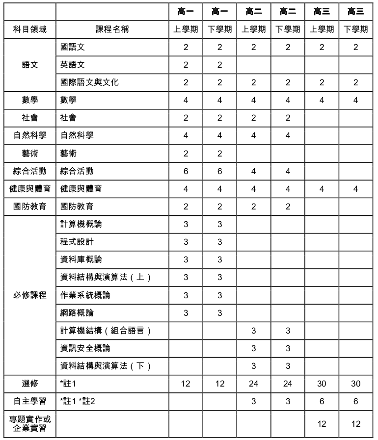

title: 築夢學院開放教育社群
output: index.html

--

<h1 style="font-size: 72px">
以經驗訴說台灣教育 
以未來訴說發展意義
</h1>
 

## Denny Huang
## 2021/09/18 @築夢學院開放教育社群

--

### Who am I ?

 
<h2 style="font-size: 60px">
  <b>Denny Huang</b>
</h2>

* SITCON 學生計算機年會共同發起人

* 雷亞遊戲 Rayark Inc. Data Team Lead

* COSCUP 開源人年會 2021 總召組

* HITCON 台灣駭客年會 2021 副總召

* <a href="http://denny.one/" target="_blank">About me</a>

--

### 題問及互動

	

## [slido.com](https://app.sli.do/event/uf1sdqmu)
## #210918

--

# 夢想

--

### 國中畢業紀念冊

	

--

	

--

	

--

	

--

# 學校教育？

--

# 高中 / 高職

--

 

	

--

 

	

--

	

--

	

--

	

--

	

--

	

--

	

--

	

--

	

--

# [Hacker School](https://hackerschool.tw/)

--

<h1 style="font-size: 72px">
  台北市駭客實驗教育機構
</h1>

--

# 實驗教育三法

--

<h1 style="font-size: 52px">
[高級中等以下教育階段非學校型態實驗教育實施條例](https://law.moj.gov.tw/LawClass/LawAll.aspx?pcode=H0070059)
</h1>

--

### 非學校型態實驗教育
- 個人
- 團體
- 機構

--

<h1 style="font-size: 72px">
  台北市駭客實驗教育機構
</h1>

--

# 駭客

--

# 駭客精神

--

### Aaron Swartz

	

## [網際網路之子](https://zh.wikipedia.org/zh-tw/%E7%B6%B2%E9%9A%9B%E7%B6%B2%E8%B7%AF%E4%B9%8B%E5%AD%90)

--

### Edward Snowden

	

## [神鬼駭客：史諾登](https://zh.wikipedia.org/zh-tw/%E7%A5%9E%E9%AC%BC%E9%A7%AD%E5%AE%A2%EF%BC%9A%E5%8F%B2%E8%AB%BE%E7%99%BB)

--

	

--

	

--

### 申請流程
- 送件
	- 補件
	- 複審
	- 決審
- 許可籌設期間
- 送件立案

--

 

	

--

# 未來可能

--

# 學習方式

--

<h1 style="font-size: 58px">
	上次看完一本書是什麼時候？ 
</h1>

--

 

	

--

 

	

--

# 第一份打工?

--

	

--

	

--

# 社團

--

	

## [大同大學資訊創意研究社](https://ttucsc.denny.one/)

--

# 社群

--

# [FLOSS Community](https://hackmd.io/@SITCON/floss-community-list)
## [FLOSS](https://ossf.denny.one/tw/legal-column-list/508-2010-07-15-10-50-34)

--

# [OpenFoundry](https://ossf.denny.one/)

--

  
  <h2>COSCUP</h2>
  <a href="http://coscup.org/">https://coscup.org</a>

--

  
  <h2>Students’ Information Technology Conference</h2>
  <a href="http://sitcon.org/">https://sitcon.org</a>

--

# 給學生一個發表的舞台。

--

# 研討會
## Since 2013
## 200 人 -> 1200 人 -> 1600 人（線上）

--

  

--

  

--

  

--

  

--

# 讓一群熱愛資訊的人有交流的機會。

--

  

--

  

## [SITCON 2021 虛擬會場](https://gather.town/app/VGDsDLUeG7nAXrld/SITCON%202021%20Space%2001)

--

### 更多 SITCON 活動
- [SITCON Camp](https://sitcon.camp)
	- [SITCON Camp Online 2021](https://www.flickr.com/photos/sitcon/albums/72157719756462252)
- Hour of Code
	- [2021 花蓮](https://www.flickr.com/photos/sitcon/albums/72157717212914487)
- Workshop
- 定期聚
- Hackgen

--

# 參與 -> 貢獻
## [了解各組分工](https://sitcon.org/2021/team) / [預約跳坑表單](https://forms.gle/ktKXrwMwVvD4FNB49)

--

# 傳統?

--

# 目的

--

### 延伸閱讀
- [成為 Web 開發人員的路線圖](https://github.com/goodjack/developer-roadmap-chinese/blob/master/README.md)
- [提問的智慧](https://github.com/ryanhanwu/How-To-Ask-Questions-The-Smart-Way/blob/main/README.md)

--

# 聲明

--

# Q & A

--

<h1 style="font-size: 72px">
  Thanks for listening!
</h1>

   

  

<h2 style="font-size: 18px">
本投影片採用<a href="https://creativecommons.org/licenses/by/4.0/deed.zh_TW" target="_blank">創用 CC「姓名標示 4.0 國際」授權條款</a>
</h2>

